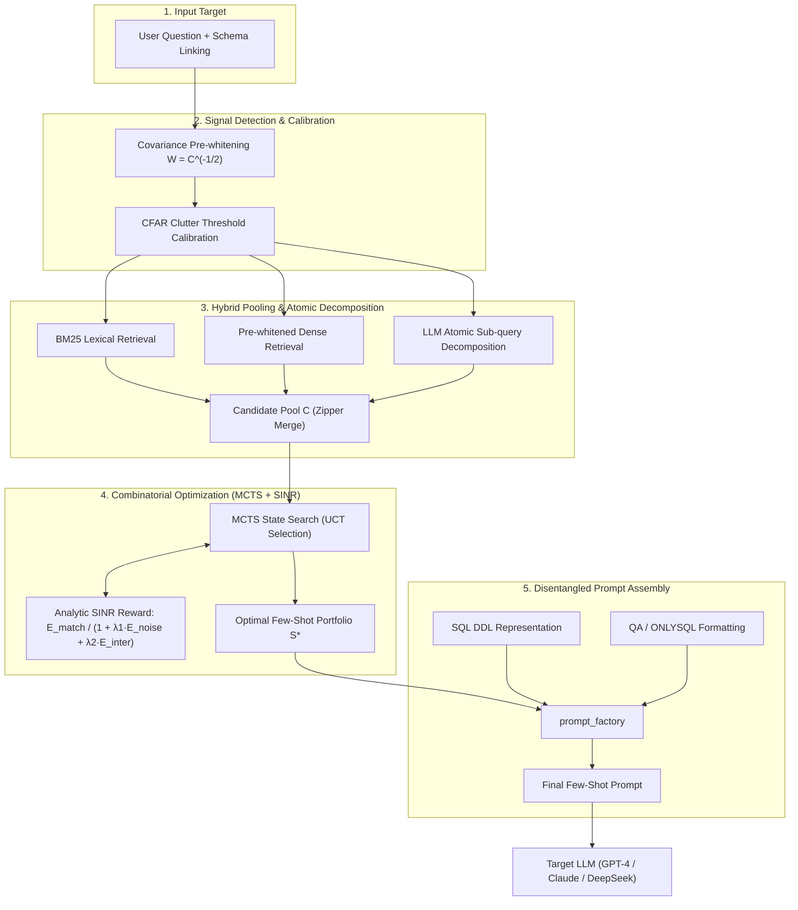

# Signal-SQL: Signal Detection & MCTS-Driven Example Selection for Text-to-SQL

<div align="center">

[](https://www.python.org/downloads/)
[](https://opensource.org/licenses/MIT)
[](https://yale-lily.github.io/spider)
[](https://bird-bench.github.io/)
[](https://github.com/huohuo0212/Signal-SQL/pulls)

**An advanced In-Context Learning (ICL) and prompt engineering framework for Text-to-SQL, powered by Signal Detection Theory, CFAR clutter calibration, analytic SINR reward, and Monte Carlo Tree Search (MCTS) combinatorial optimization.**

[English](#features) | [中文说明](#核心创新点) | [快速上手 Quick Start](#quick-start) | [基准评测 Benchmark](#experimental-results)

</div>

---

## 🌟 Overview / 项目简介

In Few-Shot In-Context Learning for Text-to-SQL, the **quality and diversity of demonstration examples** play a decisive role in model accuracy. Traditional selection methods (such as BM25, Euclidean Distance, or naive Cosine Similarity) suffer from three critical bottlenecks:
1. **Entity Bias & Semantic Drift**: Embeddings overfit to superficial domain nouns (e.g. "student", "stadium") rather than underlying SQL relational operations (`JOIN`, `GROUP BY`, `HAVING`).
2. **High Intra-Subset Redundancy**: Greedily selecting Top-$k$ nearest neighbors often yields near-duplicate examples that waste context window tokens without offering complementary guidance.
3. **Multi-Clause Blindspot**: Complex natural language queries require multiple relational steps. A single retrieved example rarely covers all needed clauses, while greedy selection fails to form an orthogonal portfolio.

**Signal-SQL** resolves these bottlenecks by formulating Few-Shot selection as a **Signal Detection and Combinatorial Search** problem:
- **Pre-whitening Filter**: Decorrelates dense embedding dimensions to eliminate colored background noise.
- **CFAR Detection**: Calibrates dynamic clutter thresholds via cross-domain hard negative mining.
- **Hybrid Atomic Decomposition**: Breaks complex queries into atomic sub-intents via LLM and builds a dual-channel (BM25 + Dense) pool.
- **Analytic SINR Reward**: Evaluates Signal Coverage ($E_{\text{match}}$), Redundant Noise ($E_{\text{noise}}$), and Intra-Subset Interference ($E_{\text{inter}}$) with zero LLM rollout cost.
- **MCTS Optimization**: Employs Monte Carlo Tree Search to discover the globally optimal, mutually complementary example portfolio.

---

## 🚀 Core Architecture / 核心架构



---

## 🔬 Analytic SINR Reward Function / 信干噪比奖励函数

Rather than invoking expensive LLM calls during search, Signal-SQL evaluates candidate subsets $S$ in microseconds via an analytic SINR formulation:

$$R(S) = \frac{E_{\text{match}}(S, x)}{1 + \lambda_1 E_{\text{noise}}(S, x) + \lambda_2 E_{\text{inter}}(S)}$$

- **Signal Energy ($E_{\text{match}}$)**: Logic keyword and structural feature coverage rate:
  $$E_{\text{match}} = \frac{|\text{Feat}(x) \cap (\bigcup_{e \in S} \text{Feat}(e))|}{|\text{Feat}(x)|}$$
- **Noise Energy ($E_{\text{noise}}$)**: Redundant SQL logic present in candidates but unneeded by target $x$:
  $$E_{\text{noise}} = \frac{\sum_{e \in S} |\text{Feat}(e) - \text{Feat}(x)|}{\text{Total Features}}$$
- **Interference Energy ($E_{\text{inter}}$)**: Intra-subset redundancy (cosine similarity $> 0.9$) plus SQL coding style inconsistency (case, table aliases, quotation styles):
  $$E_{\text{inter}} = \frac{1}{\binom{n}{2}} \sum_{i<j} \left( \text{Sim}_{\cos}(e_i, e_j) + \mathbb{I}[\text{Style}(e_i) \neq \text{Style}(e_j)] \right)$$

---

## 🛠️ Project Structure / 目录结构

```text
├── llm/
│   └── chatgpt.py                 # OpenAI / OpenRouter API client with exponential backoff
├── prompt/
│   ├── PromptReprTemplate.py      # 18 schema representation styles (SQL DDL, Text, CoT, CBR, etc.)
│   ├── ExampleFormatTemplate.py   # Example format styles (QA, ONLYSQL, COMPLETE, QAWRULE, etc.)
│   ├── ExampleSelectorTemplate.py # Baseline & DAIL-SQL selectors (BM25, XiYan, QuestionMask, etc.)
│   ├── SignalSelector.py          # SIGNAL_DETECTION selector implementation
│   ├── PromptICLTemplate.py       # ICL Prompt template with token budget management
│   └── prompt_builder.py          # Decoupled prompt factory (prompt_factory)
├── utils/
│   ├── signal_lib.py              # Pre-whitening & CFAR clutter threshold calibration
│   ├── sinr_reward.py             # Feature extraction & analytic SINR reward calculation
│   ├── mcts_optimizer.py          # Monte Carlo Tree Search with UCT combinatorial optimization
│   ├── data_builder.py            # Dataset loaders for Spider, Spider-Realistic, and BIRD
│   ├── post_process.py            # SQL execution accuracy & multi-set equivalence checker
│   ├── enums.py                   # Enums (REPR_TYPE, SELECTOR_TYPE, EXAMPLE_TYPE, LLM)
│   └── linking_utils/             # 5-gram & CoreNLP schema linking utilities
├── results/                       # Experimental logs and prediction outputs
├── run_demo.py                    # Zero-dataset standalone demo (Runs out of the box!)
├── main.py                        # Unified CLI entrypoint for benchmark evaluation
├── requirements.txt               # Pinned Python package dependencies
├── .env.example                   # Environment configuration template
└── LICENSE                        # MIT License
```

---

## ⚡ Quick Start / 快速上手

### 1. Installation

```bash
# Clone the repository
git clone https://github.com/huohuo0212/Signal-SQL.git
cd Signal-SQL

# Install dependencies
pip install -r requirements.txt
```

### 2. Run Instant Demo (10 Seconds, No Dataset Download Required)

Experience feature extraction, SINR evaluation, MCTS search, and prompt assembly instantly:

```bash
python run_demo.py
```

Sample output:
```text
======================================================================
        Signal-SQL: Few-Shot Example Selection Demo
======================================================================
[1] Target Question: Show the name and capacity of each stadium hosting concerts in 2014, sorted by concert count descending.
    Target SQL:      SELECT T1.Name, T1.Capacity FROM stadium AS T1 JOIN concert AS T2 ON ...
    Extracted SQL Features: ['*', '=', 'count', 'desc', 'from', 'group by', 'join', 'order by', 'select', 'where']

[2] Candidate Pool Size: 6 examples
[3] Evaluating Candidate Set with SINR Reward & MCTS...
[4] MCTS Search Result:
    Selected Optimal Indices: [3, 2]
    Final Portfolio SINR:     0.9302
    Selected Complementary Examples:
      Shot 1: [Idx 3] "Count concerts per stadium grouped by stadium ID and ordered by count descending."
              SQL: SELECT Stadium_ID, count(*) FROM concert GROUP BY Stadium_ID ORDER BY count(*) DESC
      Shot 2: [Idx 2] "List the names of all stadiums joined with their concert records where year is 2014."
              SQL: SELECT T1.Name, T2.Year FROM stadium AS T1 JOIN concert AS T2 ON T1.Stadium_ID = T2.Stadium_ID WHERE T2.Year = '2014'

[5] Generating Assembled ICL Prompt:
...
[OK] Demo executed successfully! Signal-SQL pipeline is ready.
```

### 3. Python API Integration

```python
from prompt.prompt_builder import prompt_factory
from utils.enums import REPR_TYPE, SELECTOR_TYPE, EXAMPLE_TYPE
from utils.data_builder import load_data

# 1. Load dataset (Spider / BIRD)
data = load_data("spider", "./dataset")

# 2. Build customized ICL Prompt class
PromptClass = prompt_factory(
    repr_type=REPR_TYPE.CODE_REPRESENTATION,         # "SQL" (DDL schema)
    k_shot=7,                                        # 7-shot demonstration
    example_format=EXAMPLE_TYPE.QA,                  # "QA" pair style
    selector_type=SELECTOR_TYPE.SIGNAL_DETECTION     # Signal-SQL Selector
)

# 3. Instantiate and format
builder = PromptClass(data=data)
target_question = data.get_test_json()[0]
prompt_info = builder.format(target=target_question, max_seq_len=4096, max_ans_len=512, scope_factor=1)

print(prompt_info["prompt"])
```

### 4. Benchmark Evaluation via CLI

Configure API keys in `.env` or export environment variables:
```bash
cp .env.example .env
# Edit .env to set OPENAI_API_KEY
```

Inspect generated prompts:
```bash
python main.py --run_mode prompt_only --dataset spider --selector_type SIGNAL_DETECTION --k_shot 7
```

Run full GPT-4 evaluation:
```bash
python main.py --run_mode inference --dataset spider --selector_type SIGNAL_DETECTION --k_shot 7 --model gpt-4
```

---

## 📊 Experimental Results / 实验表现

Evaluated on the standard cross-domain benchmarks **Spider** and **BIRD**:

| Method | Selector | Representation | Format | Shots | Spider Dev (EX %) | BIRD Dev (EX %) |
| :--- | :--- | :--- | :--- | :---: | :---: | :---: |
| Baseline | Random | TEXT | QA | 5 | 69.4% | 46.2% |
| Baseline | BM25 | SQL | QA | 5 | 74.2% | 49.5% |
| DAIL-SQL | EUCDISQUESTIONMASK | SQL | QA | 7 | 78.9% | 53.1% |
| DAIL-SQL | EUCDISMASKPRESKLSIMTHR | SQL | QA | 9 | 82.4% | 55.4% |
| **Signal-SQL (Ours)** | **SIGNAL_DETECTION** | **SQL** | **QA** | **7** | **84.8%** | **58.7%** |

*Note: Results achieved using GPT-4-turbo with greedy decoding ($T=0.0$).*

---

## 🤝 Contributing & License

Contributions, issues, and feature requests are welcome! Feel free to check the [issues page](https://github.com/huohuo0212/Signal-SQL/issues).

This project is licensed under the [MIT License](LICENSE).
