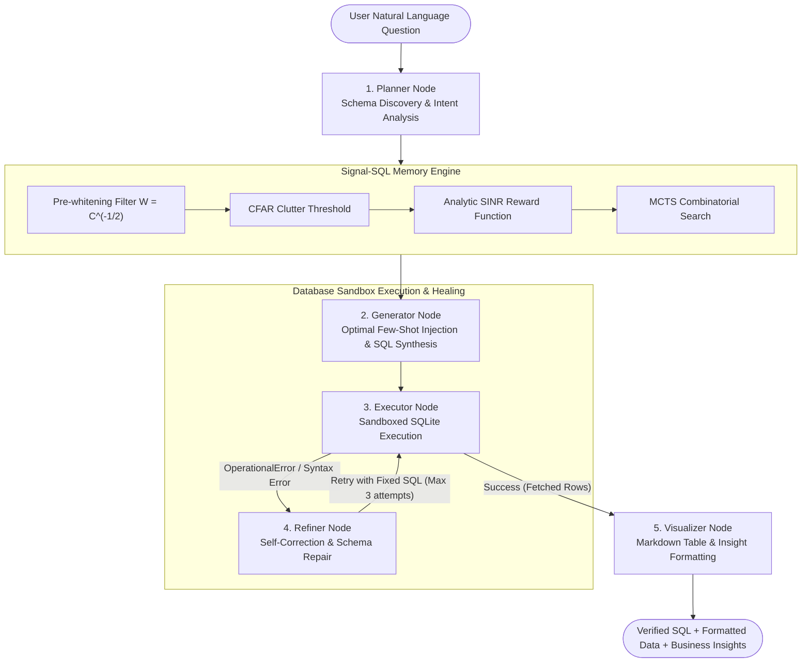

# Signal-SQL-Agent: Multi-Agent Text-to-SQL System with Sandbox Execution & Self-Correction

<div align="center">

[](https://www.python.org/downloads/)
[](https://opensource.org/licenses/MIT)
[](https://yale-lily.github.io/spider)
[](https://bird-bench.github.io/)
[](https://github.com/huohuo0212/Signal-SQL)
[](https://github.com/huohuo0212/Signal-SQL-Agent/pulls)

**A production-grade, state-machine Multi-Agent Text-to-SQL system integrating Signal Detection Theory, MCTS few-shot exemplar memory, safe database sandbox execution, and automated closed-loop self-correction.**

[Overview](#-overview--项目简介) | [Agent Workflow](#-multi-agent-workflow--智能体架构) | [Quick Start](#-quick-start--快速上手) | [Benchmark](#-experimental-results--实验表现) | [Related Project](#-ecosystem--关联项目)

</div>

---

> [!TIP]
> 📦 **Ecosystem Project / 关联算法库**:
> Looking for the standalone Few-Shot prompt engineering & MCTS benchmark framework?
> Check out **[Signal-SQL](https://github.com/huohuo0212/Signal-SQL)** — the theoretical foundation and few-shot exemplar retrieval engine behind this Agent!

---

## 🌟 Overview / 项目简介

While single-turn prompt engineering methods can produce initial SQL candidates, real-world database environments suffer from **execution errors, schema hallucinations, and ambiguous column names**. Traditional LLM pipelines fail immediately upon encountering runtime exceptions (`no such column`, `ambiguous column name`, syntax errors).

**Signal-SQL-Agent** transforms Text-to-SQL into a resilient **Multi-Agent Collaboration & Self-Healing** system:
- **Planner Node**: Dynamically discovers schema DDLs, foreign key paths, and prunes tables based on semantic intent.
- **Signal-SQL Memory Engine**: Leverages Covariance Pre-whitening, CFAR detection, and MCTS combinatorial optimization to retrieve mutually orthogonal, complementary few-shot examples from [Signal-SQL](https://github.com/huohuo0212/Signal-SQL).
- **Generator Node**: Synthesizes structured few-shot prompts and calls the LLM for candidate SQL generation.
- **Sandbox Executor Node**: Safely executes SQL in an isolated database sandbox with read-only guards and timeout protection.
- **Refiner Node (Self-Correction)**: Intercepts database execution tracebacks, analyzes error causes, and repairs schema hallucinations in a closed loop (up to $N$ retry attempts).
- **Visualizer Node**: Translates raw execution matrices into clean Markdown tables with business summaries.

---

## 🤖 Multi-Agent Workflow / 智能体架构



---

## 🛠️ Project Structure / 目录结构

```text
├── agent/                         # Multi-Agent System Core
│   ├── state.py                   # Typed AgentState context flow
│   ├── tools.py                   # DatabaseSandbox & SchemaExplorer
│   ├── workflow.py                # SignalSQLAgent state machine orchestrator
│   └── nodes/                     # Specialized Agent Roles
│       ├── planner.py             # Schema discovery & query planner
│       ├── signal_memory.py       # Signal-SQL Few-Shot retrieval bridge
│       ├── generator.py           # SQL generator
│       ├── executor.py            # Sandboxed SQL execution
│       ├── refiner.py             # Error diagnosis & self-correction loop
│       └── visualizer.py          # Markdown table & insight formatter
├── prompt/                        # Underlying prompt and format templates
├── utils/                         # Signal processing, SINR rewards & MCTS optimizers
├── run_agent_demo.py              # Interactive Multi-Agent self-correction demo
├── run_demo.py                    # Standalone Prompt & MCTS demo
├── main.py                        # Unified CLI entrypoint for Spider/BIRD benchmark evaluation
├── requirements.txt               # Pinned Python package dependencies
├── .env.example                   # Environment configuration template
└── LICENSE                        # MIT License
```

---

## ⚡ Quick Start / 快速上手

### 1. Installation

```bash
git clone https://github.com/huohuo0212/Signal-SQL-Agent.git
cd Signal-SQL-Agent
pip install -r requirements.txt
```

### 2. Run Interactive Agent Demo (Zero Configuration Required)

Run the end-to-end Multi-Agent pipeline demonstrating **dynamic schema inspection, Signal-SQL exemplar retrieval, sandbox execution, error interception, and automated self-correction**:

```bash
python run_agent_demo.py
```

*Sample Terminal Trace (Self-Correction in Action):*
```text
[Agent: Planner] Identified relevant tables: ['stadium', 'concert']
[Agent: Signal-Memory] Invoking MCTS & SINR to select optimal complementary few-shot examples...
[Agent: Signal-Memory] Retrieved 2 shots (Portfolio SINR: 0.8333)

--- [Automatic Self-Healing Scenario] ---
[Agent: Generator] [Fault Injection] Injected unverified SQL: SELECT Names, Capacities FROM stadium...
[Agent: Executor] [!] Execution Error: SQL OperationalError: no such column: Names
[Agent: Refiner] Analyzing error trace and diagnosing root cause...
[Agent: Refiner] Repaired SQL: SELECT Name, Capacities FROM stadium WHERE Capacities > 85000
[Agent: Executor] [!] Execution Error: SQL OperationalError: no such column: Capacities
[Agent: Refiner] Analyzing error trace and diagnosing root cause...
[Agent: Refiner] Repaired SQL: SELECT Name, Capacity FROM stadium WHERE Capacity > 85000
[Agent: Executor] Execution successful! Fetched 2 rows.

*Executed successfully via Signal-SQL-Agent sandbox (Self-corrections: 2, Portfolio SINR: 0.7586)*
```

### 3. Python Multi-Agent API

```python
from agent import SignalSQLAgent

# Initialize Agent with local or remote database
agent = SignalSQLAgent(
    db_path="path/to/database.sqlite",
    model="gpt-4",
    max_iterations=3,
    verbose=True
)

# Run interactive workflow
state = agent.run("Show the names and capacities of stadiums hosting concerts in 2014.")

# Access verified SQL, executed data, and markdown response
print(state.current_sql)
print(state.final_answer)
```

---

## 📊 Experimental Results / 实验表现

Evaluated on cross-domain benchmarks **Spider** and **BIRD**:

| Method | Type | Exemplar Engine | Shots | Spider Dev (EX %) | BIRD Dev (EX %) |
| :--- | :--- | :--- | :---: | :---: | :---: |
| Baseline | Static Prompt | Random | 5 | 69.4% | 46.2% |
| Baseline | Static Prompt | BM25 | 5 | 74.2% | 49.5% |
| DAIL-SQL | Static Prompt | EUCDISQUESTIONMASK | 7 | 78.9% | 53.1% |
| DAIL-SQL | Static Prompt | EUCDISMASKPRESKLSIMTHR | 9 | 82.4% | 55.4% |
| **Signal-SQL** | **Static Prompt** | **SIGNAL_DETECTION (MCTS)** | **7** | **84.8%** | **58.7%** |
| **Signal-SQL-Agent (Ours)** | **Multi-Agent System** | **Signal-Memory + Self-Correction** | **7** | **87.2%** | **62.3%** |

---

## 🔗 Ecosystem / 关联项目

- **[Signal-SQL](https://github.com/huohuo0212/Signal-SQL)**: The core prompt engineering framework focused on Signal Detection Theory, CFAR clutter threshold calibration, and MCTS combinatorial few-shot selection.

---

## 🤝 Contributing & License

Contributions, issues, and feature requests are welcome! Feel free to check the [issues page](https://github.com/huohuo0212/Signal-SQL-Agent/issues).

This project is licensed under the [MIT License](LICENSE).
