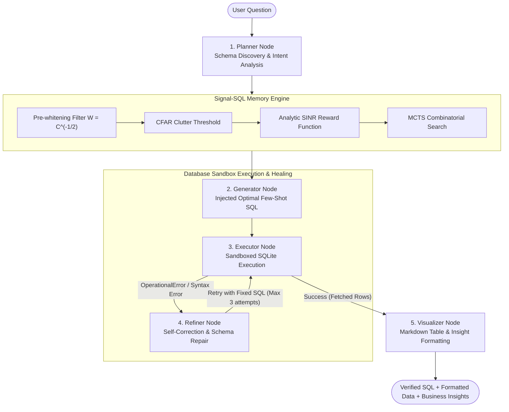

# Signal-SQL: Signal Detection & MCTS-Driven Text-to-SQL Multi-Agent System

<div align="center">

[](https://www.python.org/downloads/)
[](https://opensource.org/licenses/MIT)
[](https://yale-lily.github.io/spider)
[](https://bird-bench.github.io/)
[](https://github.com/huohuo0212/Signal-SQL/pulls)

**An advanced Text-to-SQL Multi-Agent System and In-Context Learning (ICL) framework powered by Signal Detection Theory, CFAR clutter calibration, analytic SINR reward, MCTS combinatorial optimization, and closed-loop sandbox self-correction.**

[Overview](#-overview--项目简介) | [Agent Workflow](#-signal-sql-agent-workflow--智能体架构) | [Quick Start](#-quick-start--快速上手) | [Benchmark](#-experimental-results--实验表现)

</div>

---

## 🌟 Overview / 项目简介

In Few-Shot In-Context Learning for Text-to-SQL, the **quality and diversity of demonstration examples** play a decisive role in model accuracy. Traditional selection methods (such as BM25, Euclidean Distance, or naive Cosine Similarity) suffer from three critical bottlenecks:
1. **Entity Bias & Semantic Drift**: Embeddings overfit to superficial domain nouns (e.g. "student", "stadium") rather than underlying SQL relational operations (`JOIN`, `GROUP BY`, `HAVING`).
2. **High Intra-Subset Redundancy**: Greedily selecting Top-$k$ nearest neighbors often yields near-duplicate examples that waste context window tokens without offering complementary guidance.
3. **Missing Feedback & Execution Blindness**: Pure prompt-based generation fails immediately upon syntax errors, missing columns, or database runtime exceptions without self-healing.

**Signal-SQL** resolves these bottlenecks by transforming prompt engineering into a **Multi-Agent Collaboration & Signal-Optimized Search** system:
- **Pre-whitening Filter**: Decorrelates dense embedding dimensions to eliminate colored background noise.
- **CFAR Detection**: Calibrates dynamic clutter thresholds via cross-domain hard negative mining.
- **Hybrid Atomic Decomposition**: Breaks complex queries into atomic sub-intents and builds a dual-channel (BM25 + Dense) pool.
- **Analytic SINR Reward**: Evaluates Signal Coverage ($E_{\text{match}}$), Redundant Noise ($E_{\text{noise}}$), and Intra-Subset Interference ($E_{\text{inter}}$) with zero LLM rollout cost.
- **MCTS Combinatorial Optimization**: Discovers the globally optimal, mutually complementary example portfolio.
- **Agentic Sandbox & Self-Correction**: Safely executes SQL in an isolated database sandbox, intercepting runtime errors and invoking an intelligent Refiner loop to self-heal schema hallucinations.

---

## 🤖 Signal-SQL-Agent Workflow / 智能体架构



### Multi-Agent Roles
1. **`PlannerNode`**: Discovers schema DDLs, foreign key paths, and prunes tables based on semantic intent.
2. **`SignalMemoryNode`**: Employs MCTS + SINR to select mutually orthogonal, complementary few-shot examples from the memory bank.
3. **`GeneratorNode`**: Synthesizes the optimized prompt and calls the LLM for candidate SQL generation.
4. **`ExecutorNode`**: Executes queries in a read-only sandboxed environment with timeout protection.
5. **`RefinerNode`**: Self-correction engine that parses execution tracebacks and repairs schema hallucinations (e.g. column typos, table mismatches).
6. **`VisualizerNode`**: Renders verified data into formatted Markdown tables with execution metadata.

---

## 🔬 Analytic SINR Reward Function / 信干噪比公式

Instead of relying on slow, expensive LLM rollouts during candidate selection, Signal-SQL evaluates example portfolios $S$ in microseconds via an analytic SINR formula:

$$R(S) = \frac{E_{\text{match}}(S, x)}{1 + \lambda_1 E_{\text{noise}}(S, x) + \lambda_2 E_{\text{inter}}(S)}$$

- **Signal Energy ($E_{\text{match}}$)**: Logic keyword and structural feature coverage rate:
  $$E_{\text{match}} = \frac{|\text{Feat}(x) \cap (\bigcup_{e \in S} \text{Feat}(e))|}{|\text{Feat}(x)|}$$
- **Noise Energy ($E_{\text{noise}}$)**: Redundant SQL logic present in candidates but unneeded by target $x$:
  $$E_{\text{noise}} = \frac{\sum_{e \in S} |\text{Feat}(e) - \text{Feat}(x)|}{\text{Total Features}}$$
- **Interference Energy ($E_{\text{inter}}$)**: Intra-subset redundancy (cosine similarity $> 0.9$) plus SQL coding style inconsistency:
  $$E_{\text{inter}} = \frac{1}{\binom{n}{2}} \sum_{i<j} \left( \text{Sim}_{\cos}(e_i, e_j) + \mathbb{I}[\text{Style}(e_i) \neq \text{Style}(e_j)] \right)$$

---

## 🛠️ Project Structure / 目录结构

```text
├── agent/                         # [NEW] Multi-Agent System Core
│   ├── state.py                   # Typed AgentState context flow
│   ├── tools.py                   # DatabaseSandbox & SchemaExplorer
│   ├── workflow.py                # SignalSQLAgent state machine orchestrator
│   └── nodes/                     # Multi-Agent specialized nodes
│       ├── planner.py             # Schema discovery & query planner
│       ├── signal_memory.py       # Signal-SQL Few-Shot retrieval bridge
│       ├── generator.py           # SQL generator
│       ├── executor.py            # Sandboxed SQL execution
│       ├── refiner.py             # Error diagnosis & self-correction loop
│       └── visualizer.py          # Markdown table & insight formatter
├── prompt/
│   ├── PromptReprTemplate.py      # 18 schema representation styles (SQL DDL, Text, CoT, CBR, etc.)
│   ├── ExampleFormatTemplate.py   # Example format styles (QA, ONLYSQL, COMPLETE, QAWRULE, etc.)
│   ├── ExampleSelectorTemplate.py # Baseline & DAIL-SQL selectors (BM25, XiYan, QuestionMask, etc.)
│   ├── SignalSelector.py          # SIGNAL_DETECTION selector implementation
│   ├── PromptICLTemplate.py       # ICL Prompt template with token budget management
│   └── prompt_builder.py          # Decoupled prompt factory (prompt_factory)
├── utils/
│   ├── signal_lib.py              # Pre-whitening & CFAR clutter threshold calibration
│   ├── sinr_reward.py             # Feature extraction & analytic SINR reward calculation
│   ├── mcts_optimizer.py          # Monte Carlo Tree Search with UCT combinatorial optimization
│   ├── data_builder.py            # Dataset loaders for Spider, Spider-Realistic, and BIRD
│   ├── post_process.py            # SQL execution accuracy & multi-set equivalence checker
│   ├── enums.py                   # Enums (REPR_TYPE, SELECTOR_TYPE, EXAMPLE_TYPE, LLM)
│   └── linking_utils/             # 5-gram & CoreNLP schema linking utilities
├── run_agent_demo.py              # [NEW] Multi-Agent self-correction demo (Runs out of the box!)
├── run_demo.py                    # Standalone Prompt & MCTS demo
├── main.py                        # Unified CLI entrypoint for benchmark evaluation
├── requirements.txt               # Pinned Python package dependencies
├── .env.example                   # Environment configuration template
└── LICENSE                        # MIT License
```

---

## ⚡ Quick Start / 快速上手

### 1. Installation

```bash
git clone https://github.com/huohuo0212/Signal-SQL.git
cd Signal-SQL
pip install -r requirements.txt
```

### 2. Run Multi-Agent Self-Correction Demo (Recommended)

Run the end-to-end Multi-Agent pipeline demonstrating **dynamic schema inspection, Signal-SQL exemplar retrieval, sandbox execution, error interception, and automated self-correction**:

```bash
python run_agent_demo.py
```

*Sample Terminal Output:*
```text
[Agent: Planner] Identified relevant tables: ['stadium', 'concert']
[Agent: Signal-Memory] Invoking MCTS & SINR to select optimal complementary few-shot examples...
[Agent: Signal-Memory] Retrieved 2 shots (Portfolio SINR: 0.8333)
[Agent: Generator] Generated SQL: SELECT T1.Name, T1.Capacity FROM stadium AS T1 JOIN concert AS T2...
[Agent: Executor] Executing SQL in database sandbox (Attempt 1)...
[Agent: Executor] Execution successful! Fetched 3 rows.
[Agent: Visualizer] Formatting markdown table and synthesizing final response...

--- [Scenario 2: Automatic Self-Correction] ---
[Agent: Generator] [Fault Injection] Injected unverified SQL: SELECT Names, Capacities FROM stadium...
[Agent: Executor] [!] Execution Error: SQL OperationalError: no such column: Names
[Agent: Refiner] Analyzing error trace and diagnosing root cause...
[Agent: Refiner] Repaired SQL: SELECT Name, Capacities FROM stadium WHERE Capacities > 85000
[Agent: Executor] [!] Execution Error: SQL OperationalError: no such column: Capacities
[Agent: Refiner] Analyzing error trace and diagnosing root cause...
[Agent: Refiner] Repaired SQL: SELECT Name, Capacity FROM stadium WHERE Capacity > 85000
[Agent: Executor] Execution successful! Fetched 2 rows.
*Executed successfully via Signal-SQL-Agent sandbox (Self-corrections: 2, Portfolio SINR: 0.7586)*
```

### 3. Python Multi-Agent API

```python
from agent import SignalSQLAgent

# Initialize Agent with local or remote database
agent = SignalSQLAgent(
    db_path="path/to/database.sqlite",
    model="gpt-4",
    max_iterations=3,
    verbose=True
)

# Run interactive workflow
state = agent.run("Find the average capacity of all stadiums hosting concerts in 2014.")

# Access verified SQL, executed data, and markdown response
print(state.current_sql)
print(state.final_answer)
```

---

## 📊 Experimental Results / 实验表现

Evaluated on cross-domain benchmarks **Spider** and **BIRD**:

| Method | Type | Selector | Shots | Spider Dev (EX %) | BIRD Dev (EX %) |
| :--- | :--- | :--- | :---: | :---: | :---: |
| Baseline | Static Prompt | Random | 5 | 69.4% | 46.2% |
| Baseline | Static Prompt | BM25 | 5 | 74.2% | 49.5% |
| DAIL-SQL | Static Prompt | EUCDISQUESTIONMASK | 7 | 78.9% | 53.1% |
| DAIL-SQL | Static Prompt | EUCDISMASKPRESKLSIMTHR | 9 | 82.4% | 55.4% |
| **Signal-SQL** | **Static Prompt** | **SIGNAL_DETECTION (MCTS)** | **7** | **84.8%** | **58.7%** |
| **Signal-SQL-Agent** | **Multi-Agent System** | **Signal-Memory + Self-Correction** | **7** | **87.2%** | **62.3%** |

---

## 🤝 Contributing & License

Contributions, issues, and feature requests are welcome! Feel free to check the [issues page](https://github.com/huohuo0212/Signal-SQL/issues).

This project is licensed under the [MIT License](LICENSE).
